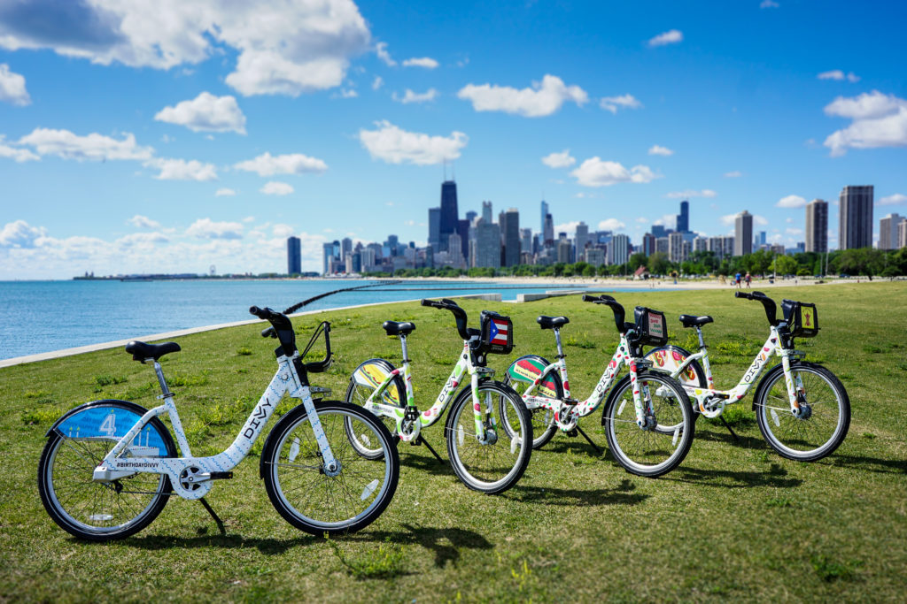

##### Google Data Analytics Professional Certificate capstone case study track one Cyclistic bike-share analysis

 image from: <https://freechicagowalkingtours.com/chicago-divvy-bike-guide/>

## Scenario

You are a junior data analyst working in the marketing analyst team at Cyclistic, a bike-share company in Chicago. The director of marketing believes the company's future success depends on maximizing the number of annual memberships. Therefore, your team wants to understand how casual riders and annual members use Cyclistic bikes differently. From these insights, your team will design a new marketing strategy to convert casual riders into annual members. But first, Cyclistic executives must approve your recommendations, so they must be backed up with compelling data insights and professional data visualizations.

Lily Moreno, the director of marketing at Cyclistics has set the clear goal to design marketing strategies aimed at converting casual riders into annual members. She believes that in order to do that, the marketing analyst team needs to better understand how annual members and casual riders differ, why casual riders would buy a membership, and how digital media could affect their marketing tactics.

For this report, I and my team consolidated the historical Cyclistics bicycle trip data from 2021-22 into one data frame and performed a simple analysis that answers the question "how do members and casual riders use Cyclistic bikes differently?" We then created a plan complete with visualizations for why casual riders would buy a membership, and recommendations for how digital media could affect their marketing tactics. This analysis will help executives to make decisions about marketing programs and strategies to convert casual riders to riders with annual memberships

Just to note: "I and my team," is simply me, since this is an exercise. And, the 2021-22 Cyclistics data set is actually 2021-22 Chicago Divvy bike data.

## Data Source

The data is 12 consecutive months of historical trip data made available to the public by Cyclistics. It is second-party data as collected by Motivate, a company employed by the City of Chicago to collect data on bike share usage (license: [Divvy Data License Agreement](https://www.divvybikes.com/data-license-agreement)). For data-privacy each trip is anonymized and wiped of payment information. This means that the data set is less helpful as it cannot be used to correlate the demographics and logistics of the homes of casual riders, member riders, and their usage of Cyclistic bikes. It also cannot be used to determine:

-   if customers have purchased multiple single passes
-   if certain rider demographics use specific kinds of bikes
-   how many people are actually represented by the data set

Also, the team was not provided with the costs of passes and memberships and therefore cannot determine any true cost saving value for using one method over another.

The data is housed at: [Divvy Data](https://divvybikes.com/system-data). It was downloaded on June 26, 2023 at 13:36.

## Deliverables

| Deliverable Description                                       | Details                                                                                                                                                            |
|:-------------------------|:---------------------------------------------|
| Documentation of cleaning and manipulation of data (analysis) | Because this analysis is a case study performed for a portfolio, I repeated the cleaning and analysis process in three separate formats: PostgreSQL, R, and Excel. |
| Charts                                                        | Data visualizations comparing the usage of rider by type. Again, this is performed in three separate formats: R, Tableau, and Excel.                               |
| Recommendations                                               | Recommendations as to why the differences.                                                                                                                         |
| Final Report                                                  | A report highlighting the differences between rider types and how these differences suggest actions for successful future marketing.                               |

## Tools Used for Analysis and Visuals

-   For cleaning, analysis, and visuals in Excel contact me

-   For cleaning and analysis in [SQL](https://rpubs.com/Nisaba/Cyclistics_2021_2022_SQL) using PostgreSQL

-   For dashboard in [Tableau](https://public.tableau.com/app/profile/nisaba/viz/HowdoCasualRidesDifferfromMemberRides/Dashboard1)

-   For cleaning, analysis, and visuals in [R](https://rpubs.com/Nisaba/Cyclistics_2021-2022_R) using RStudio
